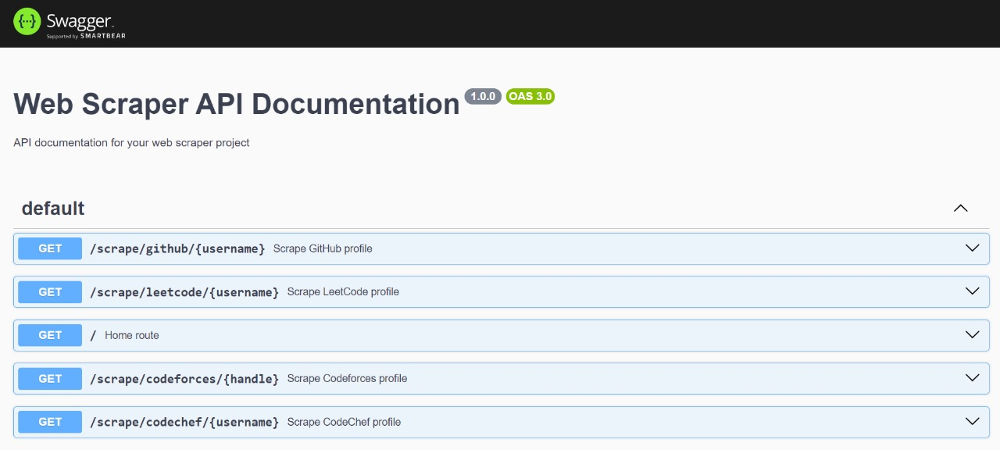

# 🚀 Coding-360 : Web Scrappers 

This project involves creating web scrappers for various coding platforms like LeetCode, GitHub, Codeforces, and CodeChef. Each platform presents unique challenges due to differences in HTML structure, access restrictions, and ethical considerations.

## demo 

## 🛠️ Tech Stack

- **Node.js**: Backend JavaScript runtime environment.
- **Puppeteer**: Node library for controlling headless Chrome (for dynamic sites like LeetCode).
- **Axios**: HTTP client for making requests and fetching HTML (for static sites like GitHub, Codeforces, etc.).
- **Cheerio**: Fast, flexible, and lean implementation of core jQuery for parsing HTML.
- **Swagger**: API documentation tool.

## 📦 Setup

- **Prerequisite**: Ensure you have Node.js installed. 
- **Installation**:
  - Clone the repo.
  - Install dependencies.
  - Configure endpoints for target sites.
  - Run server.js
  - Open your browser and navigate to http://localhost:3000/api-docs to view the API documentation.

## 🤝 Contributing
- Fork the repository.
- Create your feature branch (git checkout -b feature/yourFeature).
- Commit your changes (git commit -m 'Add your feature').
- Push to the branch (git push origin feature/yourFeature).
- Open a Pull Request.

